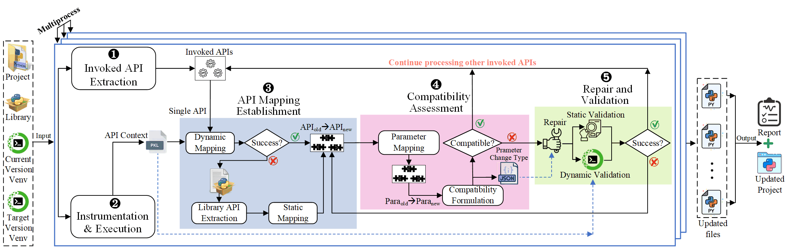

## What is PCART?
PCART is an automated tool designed to detect and repair Python API parameter compatibility issues. It is the first to achieve a fully automated process (end-to-end) that includes `API extraction`, `code instrumentation`, `mapping`, `compatibility analysis`, and `repair and validation`. PCART specializes in addressing API compatibility issues arising from parameter `addition`, `removal`, `renaming`, `reordering`, and the `conversion of positional parameters to keyword parameters`. 

## Documentation
PCART's doxygen document is available [here](https://pcart-tools.github.io/PCART-doxygen/html).


For PCART's design and implementation details, please refer to our [paper](https://doi.org/10.48550/arXiv.2406.03839).

## Evaluation
[PCBench](https://github.com/PCART-tools/PCBench) Benchmark for Python API Parameter Compatibility Issues

PCART's evaluation results are available [here](https://github.com/PCART-tools/PCART-evaluation).

## Usage
### Prerequisites
- Linux (tested on Ubuntu 18.04.1)
- Python 3.9.12
- dill 0.3.7

### Step1: Create a virtual environment
First, determine the current version and target version of the third-party library that needs to be upgraded for your project. Then, create virtual environments for the project with both the current version and the target version locally. Ensure that each virtual environment includes the corresponding version of the library. Additionally, install the `dill` library in both virtual environments by running `pip install dill`.

### Step2: Write the configuration file
In the `Configure` directory, construct a JSON configuration file for the project to be repaired, which should include the following information:
```json
{
  "projPath": "/home/usr/project",
  "runCommand": "python run.py",
  "runFilePath": "/home/usr/project/src",
  "libName": "torch"
  "currentVersion": "1.7.1",
  "targetVersion": "1.9.0",
  "currentEnv": "/home/usr/anaconda3/envs/v1",
  "targetEnv": "/home/usr/anaconda3/envs/v2"
}
```
For `runFilePath`, if the entry file is located in the first-level subdirectory of the project, the value should be an empty string, i.e., `runFilePath: ""`. For `libName`, you should fill in the name used in the code. For instance, `Pillow` should be written as `PIL`, and `scikit-learn` should be written as `sklearn`.


### Step3: Detection and Repair
**Run Command**
```shell
python main.py -cfg config.json
```

### Optional Step
During the static mapping phase, it is necessary to extract relevant API definitions from the library source code in the local virtual environment. To reduce the time users spend on extraction, we have pre-extracted some library API definitions in the `LibAPIExtraction` directory. If there are no relevant library API definitions in the `LibAPIExtraction` directory, you can execute the following command for automatic extraction:
```shell
python extractLibAPI.py -cfg config.json
```


## Usage Example
```shell
python main.py -cfg Deep-Graph-Kernels.json
```

### Output

The output consists of two parts: the updated project and a report, which is located in the `Report` directory and contains detailed records of each API's usage in the project, including the `call formats`, `call locations`, `coverage`, `parameter definitions in current version`, `parameter definitions in target version`, `compatibility status` and the `repair results`. The contents of the report are as follows:
```
Run Command: python  Kronecker_Generator.py
Total File Number: 1
Total Scipy Invoked API Number: 21
Not Covered Scipy Invoked API Number: 0/21
Covered Scipy Invoked API Number: 21/21

Compatible Scipy Invoked API Number: 20/21
Unknown Compatible Scipy Invoked API Number: 0/21

Incompatible Scipy Invoked API Number: 1/21
-> Successfully Repaired Scipy Invoked API number: 1/1
-> Failed to Repair Scipy Invoked API Number: 0/1
-> Unknown Repair Status Scipy Invoked API Number: 0/1

======================================================================================================
|           File #1: Deep-Graph-Kernels/Kronecker_Generator.py has 21 Scipy-Invoked API(s)           |
======================================================================================================
| Invoked API #1: sparse.csr_matrix(np.array([[0, 2], [5, 0]]))                                      |
|                                                                                                    |
| Location: At Line 12 in Deep-Graph-Kernels/Kronecker_Generator.py                                  |
|                                                                                                    |
| Coverage: Yes                                                                                      |
|                                                                                                    |
| Definition @0.19.1 <dynamic>: (arg1, shape=None, dtype=None, copy=False)                           |
|                                                                                                    |
| Definition @1.0.0 <dynamic>: (arg1, shape=None, dtype=None, copy=False)                            |
|                                                                                                    |
| Compatible: Yes                                                                                    |
|                                                                                                    |
|----------------------------------------------------------------------------------------------------|
|                                                                                                    |
| Invoked API #2: sparse.csr_matrix(np.array([[1, 2], [3, 4]]))                                      |
|                                                                                                    |
| Location: At Line 13 in Deep-Graph-Kernels/Kronecker_Generator.py                                  |
|                                                                                                    |
| Coverage: Yes                                                                                      |
|                                                                                                    |
| Definition @0.19.1 <dynamic>: (arg1, shape=None, dtype=None, copy=False)                           |
|                                                                                                    |
| Definition @1.0.0 <dynamic>: (arg1, shape=None, dtype=None, copy=False)                            |
|                                                                                                    |
| Compatible: Yes                                                                                    |
|                                                                                                    |
|----------------------------------------------------------------------------------------------------|
|                                                                                                    |
| Invoked API #3: sparse.kron(A, B)                                                                  |
|                                                                                                    |
| Location: At Line 14 in Deep-Graph-Kernels/Kronecker_Generator.py                                  |
|                                                                                                    |
| Coverage: Yes                                                                                      |
|                                                                                                    |
| Definition @0.19.1 <dynamic>: (A, B, format=None)                                                  |
|                                                                                                    |
| Definition @1.0.0 <dynamic>: (A, B, format=None)                                                   |
|                                                                                                    |
| Compatible: Yes                                                                                    |
|                                                                                                    |
|----------------------------------------------------------------------------------------------------|
|                                                                                                    |
| Invoked API #4: sparse.kron(A, B).toarray()                                                        |
|                                                                                                    |
| Location: At Line 14 in Deep-Graph-Kernels/Kronecker_Generator.py                                  |
|                                                                                                    |
| Coverage: Yes                                                                                      |
|                                                                                                    |
| Definition @0.19.1 <dynamic>: (order=None, out=None)                                               |
|                                                                                                    |
| Definition @1.0.0 <dynamic>: (order=None, out=None)                                                |
|                                                                                                    |
| Compatible: Yes                                                                                    |
|                                                                                                    |
|----------------------------------------------------------------------------------------------------|
|                                                                                                    |
| Invoked API #5: sparse.kron(A, B)                                                                  |
|                                                                                                    |
| Location: At Line 15 in Deep-Graph-Kernels/Kronecker_Generator.py                                  |
|                                                                                                    |
| Coverage: Yes                                                                                      |
|                                                                                                    |
| Definition @0.19.1 <dynamic>: (A, B, format=None)                                                  |
|                                                                                                    |
| Definition @1.0.0 <dynamic>: (A, B, format=None)                                                   |
|                                                                                                    |
| Compatible: Yes                                                                                    |
|                                                                                                    |
|----------------------------------------------------------------------------------------------------|
|                                                                                                    |
| Invoked API #6: sparse.kron(A, B).todense()                                                        |
|                                                                                                    |
| Location: At Line 15 in Deep-Graph-Kernels/Kronecker_Generator.py                                  |
|                                                                                                    |
| Coverage: Yes                                                                                      |
|                                                                                                    |
| Definition @0.19.1 <dynamic>: (order=None, out=None)                                               |
|                                                                                                    |
| Definition @1.0.0 <dynamic>: (order=None, out=None)                                                |
|                                                                                                    |
| Compatible: Yes                                                                                    |
|                                                                                                    |
|----------------------------------------------------------------------------------------------------|
|                                                                                                    |
| Invoked API #7: lil_matrix((100, 100))                                                             |
|                                                                                                    |
| Location: At Line 20 in Deep-Graph-Kernels/Kronecker_Generator.py                                  |
|                                                                                                    |
| Coverage: Yes                                                                                      |
|                                                                                                    |
| Definition @0.19.1 <dynamic>: (arg1, shape=None, dtype=None, copy=False)                           |
|                                                                                                    |
| Definition @1.0.0 <dynamic>: (arg1, shape=None, dtype=None, copy=False)                            |
|                                                                                                    |
| Compatible: Yes                                                                                    |
|                                                                                                    |
|----------------------------------------------------------------------------------------------------|
|                                                                                                    |
| Invoked API #8: A1.setdiag(rand(100))                                                              |
|                                                                                                    |
| Location: At Line 23 in Deep-Graph-Kernels/Kronecker_Generator.py                                  |
|                                                                                                    |
| Coverage: Yes                                                                                      |
|                                                                                                    |
| Definition @0.19.1 <dynamic>: (values, k=0)                                                        |
|                                                                                                    |
| Definition @1.0.0 <dynamic>: (values, k=0)                                                         |
|                                                                                                    |
| Compatible: Yes                                                                                    |
|                                                                                                    |
|----------------------------------------------------------------------------------------------------|
|                                                                                                    |
| Invoked API #9: A1.tocsr()                                                                         |
|                                                                                                    |
| Location: At Line 25 in Deep-Graph-Kernels/Kronecker_Generator.py                                  |
|                                                                                                    |
| Coverage: Yes                                                                                      |
|                                                                                                    |
| Definition @0.19.1 <dynamic>: (copy=False)                                                         |
|                                                                                                    |
| Definition @1.0.0 <dynamic>: (copy=False)                                                          |
|                                                                                                    |
| Compatible: Yes                                                                                    |
|                                                                                                    |
|----------------------------------------------------------------------------------------------------|
|                                                                                                    |
| Invoked API #10: lil_matrix((100, 100))                                                            |
|                                                                                                    |
| Location: At Line 28 in Deep-Graph-Kernels/Kronecker_Generator.py                                  |
|                                                                                                    |
| Coverage: Yes                                                                                      |
|                                                                                                    |
| Definition @0.19.1 <dynamic>: (arg1, shape=None, dtype=None, copy=False)                           |
|                                                                                                    |
| Definition @1.0.0 <dynamic>: (arg1, shape=None, dtype=None, copy=False)                            |
|                                                                                                    |
| Compatible: Yes                                                                                    |
|                                                                                                    |
|----------------------------------------------------------------------------------------------------|
|                                                                                                    |
| Invoked API #11: B1.setdiag(rand(100))                                                             |
|                                                                                                    |
| Location: At Line 31 in Deep-Graph-Kernels/Kronecker_Generator.py                                  |
|                                                                                                    |
| Coverage: Yes                                                                                      |
|                                                                                                    |
| Definition @0.19.1 <dynamic>: (values, k=0)                                                        |
|                                                                                                    |
| Definition @1.0.0 <dynamic>: (values, k=0)                                                         |
|                                                                                                    |
| Compatible: Yes                                                                                    |
|                                                                                                    |
|----------------------------------------------------------------------------------------------------|
|                                                                                                    |
| Invoked API #12: B1.tocsr()                                                                        |
|                                                                                                    |
| Location: At Line 33 in Deep-Graph-Kernels/Kronecker_Generator.py                                  |
|                                                                                                    |
| Coverage: Yes                                                                                      |
|                                                                                                    |
| Definition @0.19.1 <dynamic>: (copy=False)                                                         |
|                                                                                                    |
| Definition @1.0.0 <dynamic>: (copy=False)                                                          |
|                                                                                                    |
| Compatible: Yes                                                                                    |
|                                                                                                    |
|----------------------------------------------------------------------------------------------------|
|                                                                                                    |
| Invoked API #13: sparse.kron(A1, B1)                                                               |
|                                                                                                    |
| Location: At Line 36 in Deep-Graph-Kernels/Kronecker_Generator.py                                  |
|                                                                                                    |
| Coverage: Yes                                                                                      |
|                                                                                                    |
| Definition @0.19.1 <dynamic>: (A, B, format=None)                                                  |
|                                                                                                    |
| Definition @1.0.0 <dynamic>: (A, B, format=None)                                                   |
|                                                                                                    |
| Compatible: Yes                                                                                    |
|                                                                                                    |
|----------------------------------------------------------------------------------------------------|
|                                                                                                    |
| Invoked API #14: sparse.kron(A1, B1).toarray()                                                     |
|                                                                                                    |
| Location: At Line 36 in Deep-Graph-Kernels/Kronecker_Generator.py                                  |
|                                                                                                    |
| Coverage: Yes                                                                                      |
|                                                                                                    |
| Definition @0.19.1 <dynamic>: (order=None, out=None)                                               |
|                                                                                                    |
| Definition @1.0.0 <dynamic>: (order=None, out=None)                                                |
|                                                                                                    |
| Compatible: Yes                                                                                    |
|                                                                                                    |
|----------------------------------------------------------------------------------------------------|
|                                                                                                    |
| Invoked API #15: sparse.kronsum(A1, B1)                                                            |
|                                                                                                    |
| Location: At Line 39 in Deep-Graph-Kernels/Kronecker_Generator.py                                  |
|                                                                                                    |
| Coverage: Yes                                                                                      |
|                                                                                                    |
| Definition @0.19.1 <dynamic>: (A, B, format=None)                                                  |
|                                                                                                    |
| Definition @1.0.0 <dynamic>: (A, B, format=None)                                                   |
|                                                                                                    |
| Compatible: Yes                                                                                    |
|                                                                                                    |
|----------------------------------------------------------------------------------------------------|
|                                                                                                    |
| Invoked API #16: sparse.kronsum(A1, B1).toarray()                                                  |
|                                                                                                    |
| Location: At Line 39 in Deep-Graph-Kernels/Kronecker_Generator.py                                  |
|                                                                                                    |
| Coverage: Yes                                                                                      |
|                                                                                                    |
| Definition @0.19.1 <dynamic>: (order=None, out=None)                                               |
|                                                                                                    |
| Definition @1.0.0 <dynamic>: (order=None, out=None)                                                |
|                                                                                                    |
| Compatible: Yes                                                                                    |
|                                                                                                    |
|----------------------------------------------------------------------------------------------------|
|                                                                                                    |
| Invoked API #17: dia_matrix((np.array([np.array([2] * 5), np.array([1] * 5), np.array([1] * 5)]),  |
| np.array([0, 1, -1])), shape=(5, 5))                                                               |
|                                                                                                    |
| Location: At Line 43 in Deep-Graph-Kernels/Kronecker_Generator.py                                  |
|                                                                                                    |
| Coverage: Yes                                                                                      |
|                                                                                                    |
| Definition @0.19.1 <dynamic>: (arg1, shape=None, dtype=None, copy=False)                           |
|                                                                                                    |
| Definition @1.0.0 <dynamic>: (arg1, shape=None, dtype=None, copy=False)                            |
|                                                                                                    |
| Compatible: Yes                                                                                    |
|                                                                                                    |
|----------------------------------------------------------------------------------------------------|
|                                                                                                    |
| Invoked API #18: dia_matrix((np.array([np.array([2] * 5), np.array([1] * 5), np.array([1] * 5)]),  |
| np.array([0, 1, -1])), shape=(5, 5))                                                               |
|                                                                                                    |
| Location: At Line 45 in Deep-Graph-Kernels/Kronecker_Generator.py                                  |
|                                                                                                    |
| Coverage: Yes                                                                                      |
|                                                                                                    |
| Definition @0.19.1 <dynamic>: (arg1, shape=None, dtype=None, copy=False)                           |
|                                                                                                    |
| Definition @1.0.0 <dynamic>: (arg1, shape=None, dtype=None, copy=False)                            |
|                                                                                                    |
| Compatible: Yes                                                                                    |
|                                                                                                    |
|----------------------------------------------------------------------------------------------------|
|                                                                                                    |
| Invoked API #19: kron(x, y)                                                                        |
|                                                                                                    |
| Location: At Line 52 in Deep-Graph-Kernels/Kronecker_Generator.py                                  |
|                                                                                                    |
| Coverage: Yes                                                                                      |
|                                                                                                    |
| Definition @0.19.1 <dynamic>: (A, B, format=None)                                                  |
|                                                                                                    |
| Definition @1.0.0 <dynamic>: (A, B, format=None)                                                   |
|                                                                                                    |
| Compatible: Yes                                                                                    |
|                                                                                                    |
|----------------------------------------------------------------------------------------------------|
|                                                                                                    |
| Invoked API #20: scipy.sparse.lil_matrix((numVertices, numVertices))                               |
|                                                                                                    |
| Location: At Line 59 in Deep-Graph-Kernels/Kronecker_Generator.py                                  |
|                                                                                                    |
| Coverage: Yes                                                                                      |
|                                                                                                    |
| Definition @0.19.1 <dynamic>: (arg1, shape=None, dtype=None, copy=False)                           |
|                                                                                                    |
| Definition @1.0.0 <dynamic>: (arg1, shape=None, dtype=None, copy=False)                            |
|                                                                                                    |
| Compatible: Yes                                                                                    |
|                                                                                                    |
|----------------------------------------------------------------------------------------------------|
|                                                                                                    |
| Invoked API #21: scipy.linalg.expm(a, q=None)                                                      |
|                                                                                                    |
| Location: At Line 74 in Deep-Graph-Kernels/Kronecker_Generator.py                                  |
|                                                                                                    |
| Coverage: Yes                                                                                      |
|                                                                                                    |
| Definition @0.19.1 <dynamic>: (A, q=None)                                                          |
|                                                                                                    |
| Definition @1.0.0 <dynamic>: (A)                                                                   |
|                                                                                                    |
| Compatible: No                                                                                     |
|                                                                                                    |
| Repair <Successful>: scipy.linalg.expm(a)                                                          |
|                                                                                                    |
|----------------------------------------------------------------------------------------------------|
```


