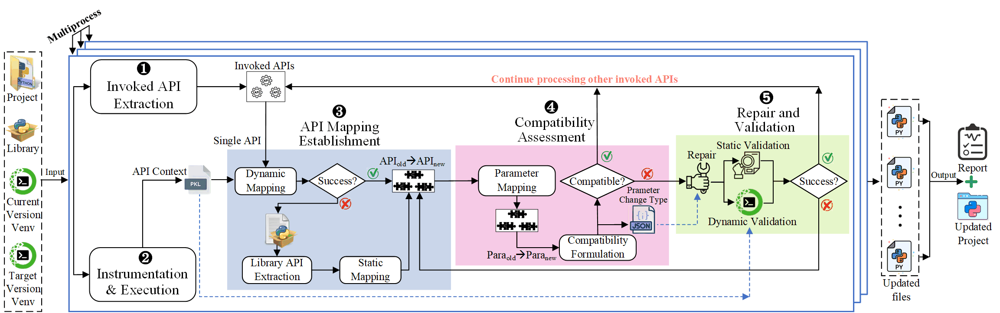

## What is PCART?

PCART is an automated tool designed to detect and repair Python API parameter compatibility issues. It is the first to achieve a fully automated process (end-to-end) that includes `API extraction`, `code instrumentation`, `mapping`, `compatibility analysis`, and `repair and validation`. PCART specializes in addressing API compatibility issues arising from parameter `addition`, `removal`, `renaming`, `reordering`, and the `conversion of positional parameters to keyword parameters`.

## Quick Start

```bash
# 1. Create virtual environments with current and target library versions
# 2. Create config.json in Configure/ directory
# 3. Run PCART
python main.py -cfg your_config.json
```

See [Configuration Guide](https://github.com/PCART-tools/PCART/wiki/Configuration-Guide) for details.

## Evaluation

- [PCBench](https://github.com/PCART-tools/PCBench) - Benchmark for Python API Parameter Compatibility Issues
- [PCART Evaluation Results](https://github.com/PCART-tools/PCART-evaluation)

## Supported Compatibility Issue Types

| Type | Description |
|------|-------------|
| Parameter Addition | A new required parameter is added in the target version |
| Parameter Removal | A parameter used in the current version is removed in the target version |
| Parameter Renaming | A parameter is renamed between versions |
| Parameter Reordering | Parameters are reordered in the function signature |
| Positional to Keyword Conversion | A parameter that was positional-only becomes keyword-only |

## Prerequisites

### PCART Runtime Environment
- Linux (tested on Ubuntu 18.04.1) or Windows (tested on Windows 11)
- Python 3.9.12
- dill 0.3.7

### Target Project Environments (for testing compatibility)
- Python 3.x (version depends on your project requirements)
- dill 0.3.7
- Libraries at current version and target version respectively

### Three-Environment Architecture

| Environment | Purpose | Requirements |
|-------------|---------|--------------|
| PCART | Runs the PCART tool itself | Python 3.9 + dill |
| currentEnv | Runs the target project (current library version) | Python 3.x + library (current version) + dill |
| targetEnv | Runs the target project (target library version) | Python 3.x + library (target version) + dill |

## Project Structure

- `API/LibApi.py` — Library API handling
- `Change/changeAnalyze.py` — API compatibility analysis (isCompatible, addValueForAPI)
- `Configure/` — Configuration files (JSON configs for different projects)
- `Example/` — Example projects for testing PCART
- `Extract/` — API extraction (getCall.py, getDef.py, extractCall.py, extractDef.py)
- `LibAPIExtraction/` — Pre-extracted library API definitions
- `Map/` — API mapping (map.py, fuzzyMatch.py)
- `Preprocess/preprocess.py` — Code preprocessing
- `Repair/repair.py` — Compatibility issue repair and validation
- `Report/` — Repair reports (output)
- `Script/` — Repair helper scripts (addValueForAPI.py, codeUtils.py, dynamicMatch.py, verifySingle.py)
- `Tool/tool.py` — Utility functions (AST parsing, config loading, file operations)
- `Load/loadData.py` — Data loading
- `Path/getPath.py` — Path handling
- `main.py` — Entry point
- `extractLibAPI.py` — Library API extraction script

## Usage

### Step 1: Create virtual environments

Determine the current version and target version of the third-party library that needs to be upgraded. Create virtual environments with both versions and install `dill` in both:

```bash
pip install dill
```

### Step 2: Write configuration file

Create a JSON file in `Configure/` directory:

**Linux:**
```json
{
  "projPath": "/home/usr/project",
  "runCommand": "python run.py",
  "runFilePath": "/home/usr/project/src",
  "libName": "torch",
  "currentVersion": "1.7.1",
  "targetVersion": "1.9.0",
  "currentEnv": "/home/usr/anaconda3/envs/v1",
  "targetEnv": "/home/usr/anaconda3/envs/v2"
}
```

**Windows:**
```json
{
  "projPath": "C:\\Users\\usr\\project",
  "runCommand": "python run.py",
  "runFilePath": "C:\\Users\\usr\\project\\src",
  "libName": "torch",
  "currentVersion": "1.7.1",
  "targetVersion": "1.9.0",
  "currentEnv": "C:\\Users\\usr\\anaconda3\\envs\\v1",
  "targetEnv": "C:\\Users\\usr\\anaconda3\\envs\\v2"
}
```

**Notes:**
- `runFilePath`: Empty string `""` if entry file is in project root; set to subdirectory path if entry file is in a first-level subdirectory
- `libName`: Use the name as it appears in code (e.g., `PIL` for Pillow, `sklearn` for scikit-learn)

### Step 3: Run detection and repair

```bash
python main.py -cfg your_config.json
```

### Optional: Extract library API definitions

```bash
python extractLibAPI.py -cfg your_config.json
```

## Cross-Platform Notes

- Windows: Use backslashes (`\\`) or forward slashes (`/`) in JSON paths
- The tool automatically handles path separator conversion internally

## Example

```bash
python main.py -cfg Configure/Deep-Graph-Kernels.json
```

## Documentation

For detailed tutorials, troubleshooting, and advanced usage, please visit the [PCART Wiki](https://github.com/PCART-tools/PCART/wiki).

If you use PCART in your work, please cite:

```
@article{PCART_TSE2025,
  author={Zhang, Shuai and Xiao, Guanping and Wang, Jun and Lei, Huashan and He, Gangqiang and Liu, Yepang and Zheng, Zheng},
  journal={IEEE Transactions on Software Engineering},
  title={PCART: Automated Repair of Python API Parameter Compatibility Issues},
  year={2026},
  volume={52},
  number={3},
  pages={723-753},
  doi={10.1109/TSE.2025.3646150}
}
```

**PCART**'s doxygen document is available [here](https://pcart-tools.github.io/PCART-doxygen/html).