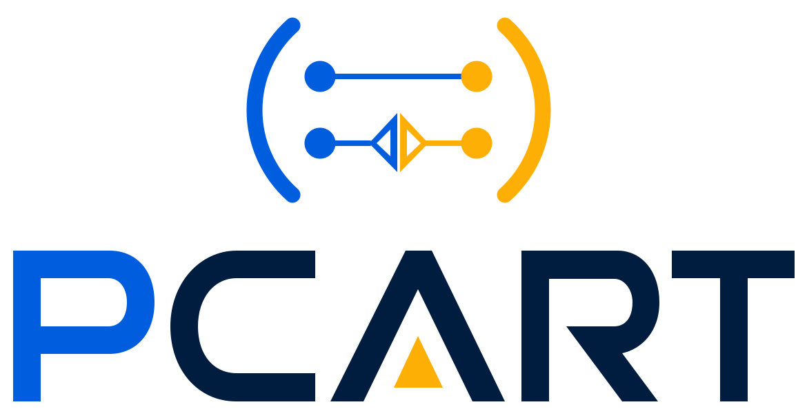

<p align="center">
  
</p>

<p align="center">
  Automated Repair of Python API Parameter Compatibility Issues
</p>

<p align="center">
  <a href="https://github.com/PCART-tools/PCART/wiki">Documentation</a> ·
  <a href="https://github.com/PCART-tools/PCART/wiki/Configuration-Guide">Configuration Guide</a> ·
  <a href="https://github.com/PCART-tools/PCART/wiki/Examples">Examples</a> ·
  <a href="https://pcart-tools.github.io/PCART-doxygen/html">API Docs</a>
</p>

<br>

## What is PCART?

PCART is an automated tool designed to detect and repair Python API parameter compatibility issues. It is the first to achieve a fully automated process (end-to-end) that includes `API extraction`, `code instrumentation`, `mapping`, `compatibility analysis`, and `repair and validation`. PCART specializes in addressing API compatibility issues arising from parameter `addition`, `removal`, `renaming`, `reordering`, and the `conversion of positional parameters to keyword parameters`.

## Quick Start

Create the required environments and configuration file, then run:

```bash
python main.py -cfg your_config.json
```

For environment setup, configuration fields, and platform-specific examples, see the [Quick Start](https://github.com/PCART-tools/PCART/wiki/Quick-Start) and [Configuration Guide](https://github.com/PCART-tools/PCART/wiki/Configuration-Guide).

## Three-Environment Architecture

| Environment | Purpose | Requirements |
|-------------|---------|--------------|
| PCART | Runs the PCART tool itself | Python 3.9 + dill |
| currentEnv | Dynamic API signature mapping for current library version | Python 3.x + current library version + dill |
| targetEnv | Dynamic API signature mapping and post-repair validation for target library version | Python 3.x + target library version + dill |

`currentEnv` and `targetEnv` should point to environment root directories. See the [Configuration Guide](https://github.com/PCART-tools/PCART/wiki/Configuration-Guide) for details.

## Supported Parameter Change Types

| Dictionary Key | Type Name | Description | Support |
|----------------|-----------|-------------|---------|
| `delete` | Deletion | Parameter removed | ✅ Full |
| `typeChange` | Type Change | Parameter type altered | ⚠️ Partial |
| `rename` | Renaming | Parameter name changed | ✅ Full |
| `posChange` | Position Change | Parameter position altered | ✅ Full |
| `replace` | Replacement | Parameter replaced at same position | ✅ Full |
| `pos2key` | Positional to Keyword | Positional-only changed to keyword-only | ✅ Full |
| `addPos` | Add Positional | New positional parameter added | ✅ Full |
| `addKey` | Add Keyword | New keyword parameter added | ✅ Full |
| `key2pos` | Keyword to Positional | Keyword changed to positional | ✅ Full |
| `value` | Default Value Change | Parameter default value changed | ❌ Not implemented |

**Total: 10 parameter change types**

> ⚠️ **Note**: `typeChange` only checks if the old type is identical to or a subset of the new type for complex annotations (Union/Optional/|).

## Evaluation

- [PCBench](https://github.com/PCART-tools/PCBench) - Benchmark for Python API Parameter Compatibility Issues
- [PCART Evaluation Results](https://github.com/PCART-tools/PCART-evaluation)

## Project Structure

- `API/LibApi.py` - Library API handling
- `Change/changeAnalyze.py` - API compatibility analysis (`isCompatible`, `addValueForAPI`)
- `Configure/` - Configuration files
- `Example/` - Example projects for testing PCART
- `Extract/` - API extraction (`getCall.py`, `getDef.py`, `extractCall.py`, `extractDef.py`)
- `LibAPIExtraction/` - Pre-extracted library API definitions
- `Load/loadData.py` - Data loading
- `Map/` - API mapping (`map.py`, `fuzzyMatch.py`)
- `Path/getPath.py` - Path handling
- `Preprocess/preprocess.py` - Code preprocessing
- `Repair/repair.py` - Compatibility issue repair and validation
- `Report/` - Repair reports
- `Script/` - Repair helper scripts (`addValueForAPI.py`, `codeUtils.py`, `dynamicMatch.py`, `verifySingle.py`)
- `Tool/tool.py` - Utility functions
- `main.py` - Entry point
- `extractLibAPI.py` - Library API extraction script

## Documentation

- [PCART Wiki](https://github.com/PCART-tools/PCART/wiki) - Tutorials, troubleshooting, and advanced usage
- [Configuration Guide](https://github.com/PCART-tools/PCART/wiki/Configuration-Guide) - Complete configuration reference
- [Examples](https://github.com/PCART-tools/PCART/wiki/Examples) - Example projects and configuration files
- [Troubleshooting](https://github.com/PCART-tools/PCART/wiki/Troubleshooting) - Common setup and runtime issues
- [Doxygen API Docs](https://pcart-tools.github.io/PCART-doxygen/html) - Generated code documentation

## Citation

If you use PCART in your work, please cite:

```bibtex
@article{PCART_TSE2025,
  author={Zhang, Shuai and Xiao, Guanping and Wang, Jun and Lei, Huashan and He, Gangqiang and Liu, Yepang and Zheng, Zheng},
  journal={IEEE Transactions on Software Engineering},
  title={PCART: Automated Repair of Python API Parameter Compatibility Issues},
  year={2026},
  volume={52},
  number={3},
  pages={723-753},
  doi={10.1109/TSE.2025.3646150}
}
```
